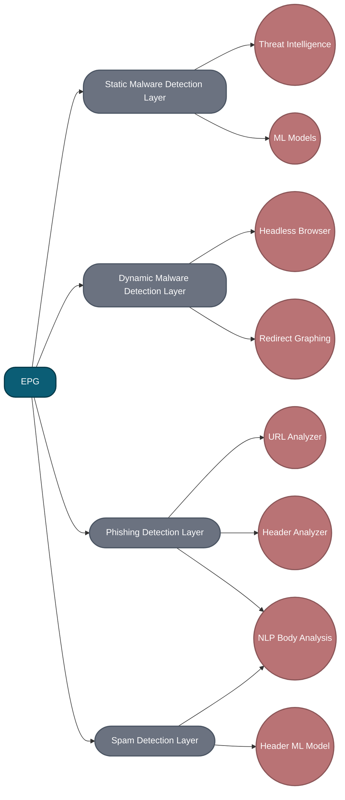

# EPG System Map

This document visualizes the core components and analytical layers of the Email Protection Gateway (EPG).

```mermaid
graph LR
    EPG[EPG]

    %% Layers
    EPG --> SM[Static Malware Detection Layer]
    EPG --> DM[Dynamic Malware Detection Layer]
    EPG --> PD[Phishing Detection Layer]
    EPG --> SD[Spam Detection Layer]

    %% Facts
    SM --> SM1((Threat Intelligence))
    SM --> SM2((ML Models))
    
    DM --> DM1((Headless Browser))
    DM --> DM2((Redirect Graphing))
    
    PD --> PD1((URL Analyzer))
    PD --> PD2((Header Analyzer))
    
    PD --> CF((NLP Body Analysis))
    SD --> CF
    
    SD --> SD1((Header ML Model))
    
    %% Styling
    classDef mainNode fill:#0b5d75,stroke:#063a49,stroke-width:2px,color:#fff,rx:20,ry:20
    classDef layerNode fill:#6b7280,stroke:#4b5563,stroke-width:2px,color:#fff,rx:30,ry:30
    classDef factNode fill:#b97375,stroke:#8b5658,stroke-width:2px,color:#fff

    class EPG mainNode
    class SM,DM,PD,SD layerNode
    class SM1,SM2,DM1,DM2,PD1,PD2,CF,SD1 factNode
```
